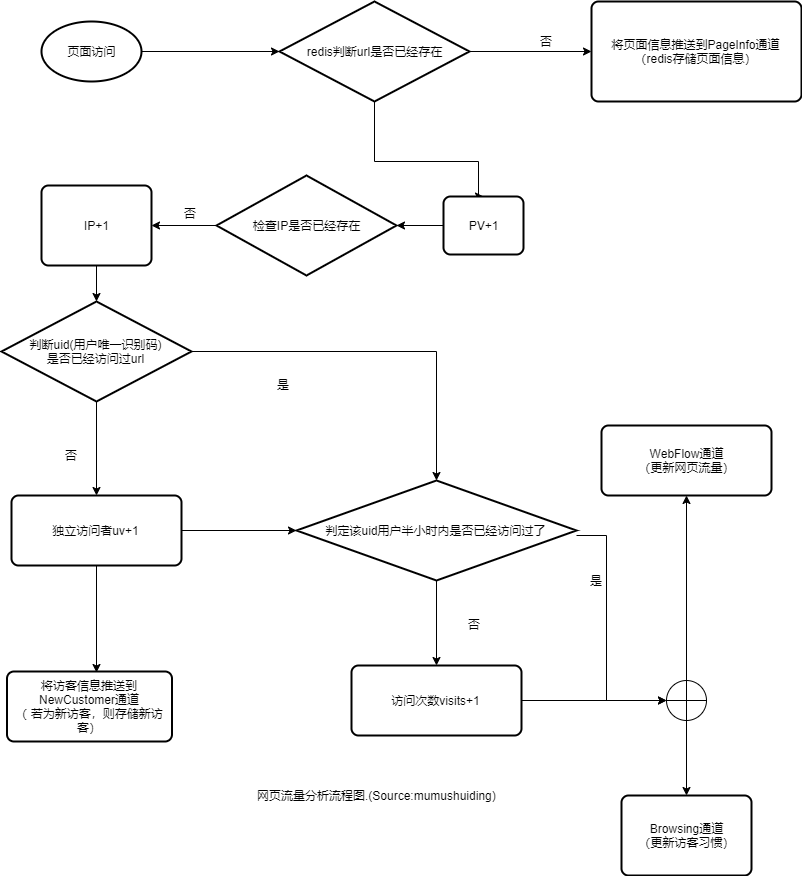

## 信息搜集

标题、url、发稿日期、编辑、节点、访问日期、IP、浏览时长、终端、地域、

## 流量统计

url、节点、页面浏览量、访问者数、访问IP数、访问人次、平均浏览时长、跳出率、区域、

type struct WebFlow {
  dns string // 域名
  url string // 网址
  catalogs string // 目录节点
  pv int // 页面浏览量
  ip int // 访问ip数
  uv int // 独立访问者数
  visits int // 访问次数(半个小时内多次算一次)
  duration long // 浏览时长
  br int // Bounce Rate 跳出率,只访问一次就跳出
  nc int // 0为用户回访,1为今天新访客
  region string // 区域
  os string // 操作系统
  browser string // 浏览器
  deviceType int // 终端类型 0为电脑、1为手机
  sr string // 屏幕分辨率
  start time.Time  // 开始时间
}
## 访客习惯

type struct Browsing {
  uid string // 用户id
  date time.TimeStamp // 时间
  depth int // 访问页面数
  pv int // 页面浏览量
  visits int // 访问次数(半个小时内多次算一次)
  duration long // 浏览时长

}

## 网页流量统计流程图

## 前端js代码架构设计

fh.js 为公共代码，功能包含:

  1. 域名判断

  2. js加载
  
fa.js 为流量分析代码

## 缓存、机器人、cookies删除对统计的影响

 
